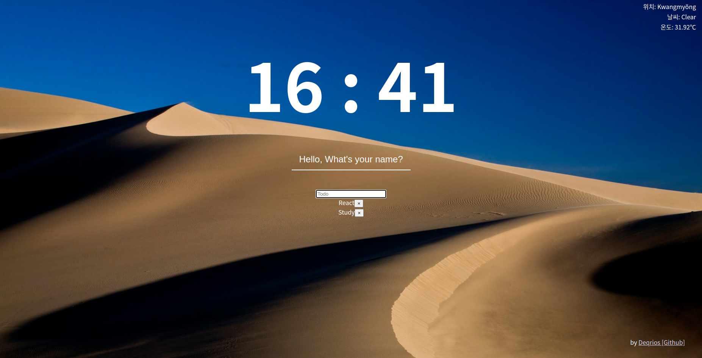

# DashBoard

checking todo list, show time and today weather.

## Preview

## Features

-   Writing todo
-   Writing UserName

## Reference

-   OpenWeatherMap API.

## Complement

백엔드와 연결 필요. (백엔드 공부할 때 손 댈듯...)

디자인 작업 필요. (귀찮은 작업...)

최적화 & 클린코드.

## etc...

각각의 컴포넌트들이 각각 state를 가지고 독립적으로 동작하게 구현해 놓았다.

App.js에서 모든 state를 관리하며 props로 뿌려주는게 좋은지, 이렇게 독립적으로 state를 관리하는게 좋은지 모르겠지만,

아마 다음에 배울 context API나 redux로 데이터들을 통합관리하는 방법을 통해 refactoring 해야 할 것이다.
